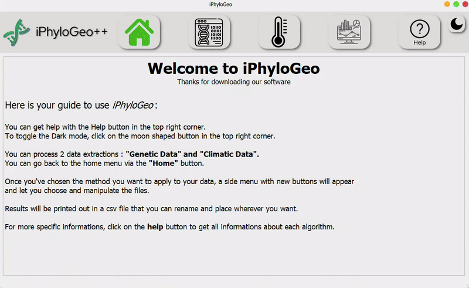
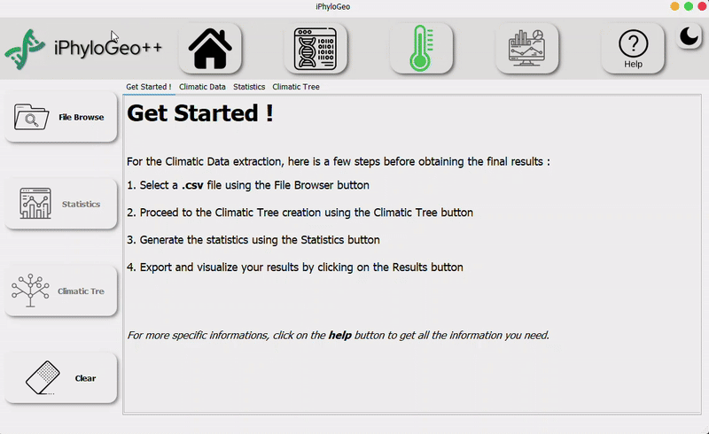
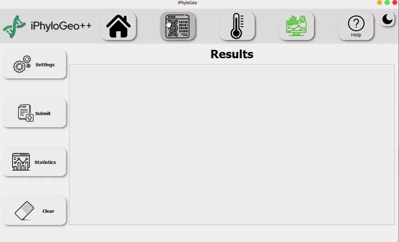

<h1 align="center">🌳 iPhyloGeo++</h1>

<p align="center">
  <a href="https://opensource.org/licenses/MIT">
    
  </a>
  <a href="https://pysd.readthedocs.io/en/latest/development/development_index.html">
    
  </a>
  <a href="https://pypi.python.org/pypi/pysd/">
    
  </a>
  <a href="https://hits.seeyoufarm.com">
    
  </a>
</p>

<h2 align="center">Multi-platform Application for Analyzing Phylogenetic Trees with Climatic Parameters</h2>

<table style="width:100%; border: none;">
  <tr>
    <td style="vertical-align: top; width: 50%;">
      <details open>
        <summary><strong>Table of Contents</strong></summary>
        <ol>
          <li><a href="#about-the-project">About the Project</a></li>
          <li><a href="#features">Features</a></li>
          <li><a href="#installation">Installation</a></li>
          <li><a href="#usage">Usage</a></li>
          <li><a href="#project-structure">Project Structure</a></li>
          <li><a href="#contributing">Contributing</a></li>
          <li><a href="#references">References</a></li>
          <li><a href="#contact">Contact</a></li>
        </ol>
      </details>
    </td>
    <td style="vertical-align: top; width: 50%; text-align: center;">
      
    </td>
  </tr>
</table>


# About the Project
The iPhyloGeo++ tool is an advanced bioinformatics application specifically designed for the integration and analysis of phylogeographic data. By leveraging both genetic and climatic information, it offers comprehensive insights into the evolutionary processes and geographical distribution of various species.

# Features
- **Cross-Platform Compatibility:** Compatible with Windows, macOS, and Linux.
- **Comprehensive Data Integration:** Merges genetic sequences with climatic data for robust analysis.
- **Intuitive User Interface:** Developed with PyQt5 to ensure ease of use.
- **Advanced Visualization Tools:** Provides visualization of phylogenetic trees and climatic data on interactive maps.
- **Enhanced Comparative Analysis:** Facilitates the comparison of different phylogenetic trees.

# [Installation](https://github.com/tahiri-lab/iPhyloGeo_plus_plus/wiki/Getting-Started)
**1. Clone the repository**
```sh
git clone https://github.com/tahiri-lab/iPhyloGeo_plus_plus.git
cd iPhyloGeo_plus_plus
```

**2. Set Up a Virtual Environment**
```sh
python3 -m venv iPhyloGeo++_env   # Use only `python` instead of `python3` if it doesn't work

# Linux
source iPhyloGeo++_env/bin/activate  

# Windows 
iPhyloGeo++_env\Scripts\activate
```

**3. Install Dependencies**
```sh
pip install -r requirements.txt
```

**4. Run the Application**
```sh
python3 main.py
```

# [Usage](https://github.com/tahiri-lab/iPhyloGeo_plus_plus/wiki/Discover-the-application)
## Loading Genetic Data
<p align="center"></p>


1. **Navigate to File Browser on the Genetic Page:**
- Access the genetic data interface through the File Browser tab.
- Select and Load Your Fasta File:

To help you, you can go to the <a href="https://github.com/tahiri-lab/iPhyloGeo_plus_plus/wiki/Discover-the-application">Wiki</a> to understand how to navigate into the iPhyloGeo application.

2. **Choose your Fasta file containing the genetic sequences. Supported formats should be specified (e.g., .fasta, .fa).**
- Ensure the file adheres to the correct format and structure.
- Perform Sequence Alignment, Statistics, and Generate Genetic Trees:

3. **Sequence Alignment:**
- Utilize built-in tools for aligning sequences, detailing available algorithms (e.g., MUSCLE, ClustalW).
- Statistics: Generate statistics such as nucleotide frequencies, sequence length distribution, and GC content.
- Genetic Trees: Construct phylogenetic trees using methods like Neighbor-Joining, Maximum Likelihood, or Bayesian inference. Visualize trees with options for customization (e.g., color-coding branches, annotating clades).

   
## Loading Climatic Data
<p align="center"></p>

1. **Navigate to File Browser on the Climatic Page:**
- Access the climatic data interface through the File Browser tab.
- Select and Load Your CSV File Containing Climatic Data:
- Choose your CSV file with climatic information. Supported data formats and required structure should be clarified.

2. **View the Generated Maps, Data Tables, Statistics, and Climatic Trees as Needed:**
   
- Display and interact with the visual representations of the climatic data, including maps, tables, and statistical summaries.
   
## Displaying Results
<p align="center"></p>

1. **Navigate to the Results Page:**
- Access the results interface.

2. **Adjust the Parameters as Needed:**
- Modify settings to refine the analysis.

3. **Click on Submit to View the Phylogenetic Results:**
- Generate and display the results based on the input data and parameters.

4. **Navigate to the Stats Button for Phylogenetic Trees Visualization:**
- Use the stats button to visualize the phylogenetic trees and related statistics.


To help you, you can follow the <a href="https://github.com/tahiri-lab/iPhyloGeo_plus_plus/wiki/Tutorial">Tutorial</a> part of the Wiki to achieve all these steps.
# Project Structure
This project is organized into several key directories to help you navigate and understand the codebase.
- **img/:** Contains images used by the README and the application.
- **datasets/:** Includes sample data for testing purposes.
- **scripts/:** Houses the Python files for the project.
- **requirements.txt:** List of dependencies.
- **scripts/main.py:** Main application entry point.

# Contributing
We welcome contributions to iPhyloGeo++. Please follow these steps:
1. Fork the repository.
2. Create a new branch (`git checkout -b feature-branch`).
3. Commit your changes (`git commit -am 'Add new feature'`).
4. Push to the branch (`git push origin feature-branch`).
5. Create a new Pull Request.

# References
1️⃣ Calculation of distance between phylogenetic tree: **Least Square metric**
+ [Cavalli-Sforza, L. L., & Edwards, A. W. (1967). Phylogenetic analysis. Models and estimation procedures. American journal of human genetics, 19(3 Pt 1), 233.](https://www.ncbi.nlm.nih.gov/pmc/articles/PMC1706274/)
+ [Felsenstein, J. (1997). An alternating least squares approach to inferring phylogenies from pairwise distances. Systematic biology, 46(1), 101-111.](https://pubmed.ncbi.nlm.nih.gov/11975348/)
+ [Makarenkov, V., & Lapointe, F. J. (2004). A weighted least-squares approach for inferring phylogenies from incomplete distance matrices. Bioinformatics, 20(13), 2113-2121.](https://pubmed.ncbi.nlm.nih.gov/15059836/)

2️⃣ Calculation of distance between phylogenetic tree: **Robinson-Foulds metric**
+ [Robinson, D.F. and Foulds, L.R., 1981. Comparison of phylogenetic trees. Mathematical biosciences, 53(1-2), pp.131-147.](https://www.sciencedirect.com/science/article/abs/pii/0025556481900432?via%3Dihub)
    
3️⃣ Dataset full description: **Analysis of genetic and climatic data of SARS-CoV-2**
+ [Koshkarov, A., Li, W., Luu, M. L., & Tahiri, N. (2022). Phylogeography: Analysis of genetic and climatic data of SARS-CoV-2.](https://conference.scipy.org/proceedings/scipy2022/nadia_tahiri.html)

# Contact
Please email us at: <Nadia.Tahiri@USherbrooke.ca> for any questions or feedback.
